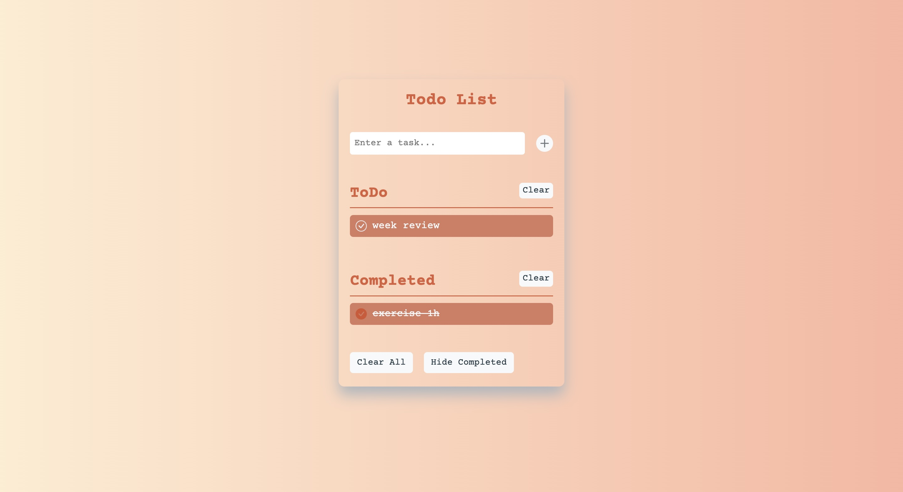

# 01 Todo List

**Other Languages: [简体中文](README_zh.md)**

## Introduction

This is a simple Todo List application that allows users to add, delete, and modify the status of their tasks. The project is built using plain JavaScript and HTML/CSS, with data persisted using `localStorage`, aiming to provide a user-friendly task management tool.

## Features

- **Add Todo Items**: Users can input tasks and add them to the list.
- **Delete Todo Items**: Users can delete existing tasks.
- **Modify Status**: Users can mark tasks as completed or uncompleted.
- **Clear Completed Todo Items**: Users can clear all completed tasks with one click.
- **Empty All Todo Items**: Users can clear the entire todo list.
- **Toggle Visual Status**: Users can choose whether to display completed tasks.

## Tech Stack

- HTML
- CSS
- JavaScript

## How to Use

1. Open the `index.html` file in your browser to view and use the application.

## Code Structure

- `index.html`: The main HTML file.
- `style.css`: The styles file.
- `index.js`: The main logic file, including event bindings and data management functionalities.

## Main Functionality Implementation

- **Todo Class**: Encapsulates the properties of each todo item, such as text, completion status, creation date, and completion date.
- **Data Management Functions**:

  - `addTodo(text)`: Adds a new todo item.
  - `removeTodo(item)`: Deletes the specified todo item.
  - `toggleTodo(item)`: Toggles the completion status of the todo item.
  - `saveToStorage()`: Saves the todo items to `localStorage`.
  - `getStorage()`: Retrieves todo items from `localStorage`.

- **Rendering Function**: The `render()` function is responsible for rendering the todo items on the webpage, including both completed and uncompleted tasks.

## Event Handling

- The `input` and `keydown` events on the input field are used to add new todo items.
- The click events on various buttons are used for corresponding functionalities, such as clearing completed items or emptying the list.

---

Thank you for reading this README document! We hope you enjoy this Todo List project and that it helps you manage your tasks effectively.
