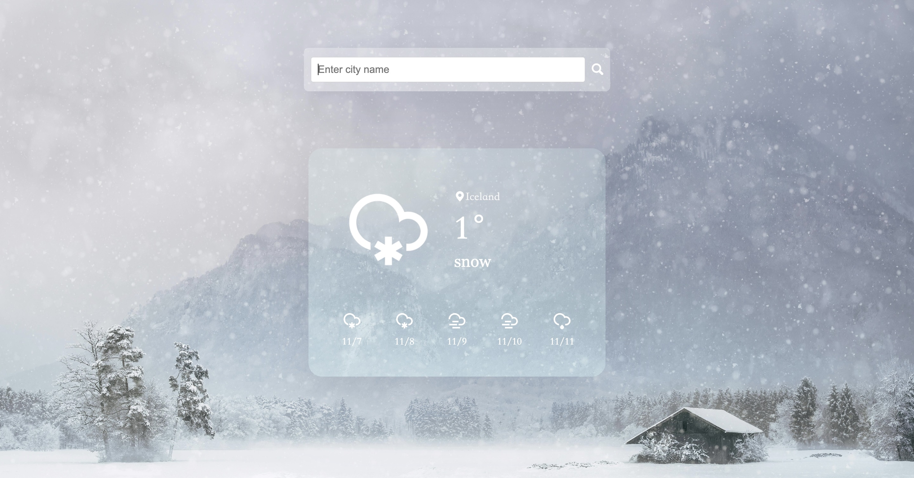

# 02 Weather Query Application

English | [简体中文](./README_zh.md)

## Overview

This is a weather query application that allows users to get current weather and forecasts for the next few days by entering a city name or postal code.

## Features

- Current weather querying
- Display weather forecasts
- Dynamic background changes based on weather conditions

## Usage

1. Replace the `appId` in `script.js` with your OpenWeatherMap API Key.
2. Enter a city name or postal code in the input box, and click the search button or press the Enter key to perform a query.

## Main Functions

- `searchWeather()`: Fetches current weather data
- `forecastWeather()`: Retrieves future weather forecasts
- `init()`: Initializes and displays weather information
