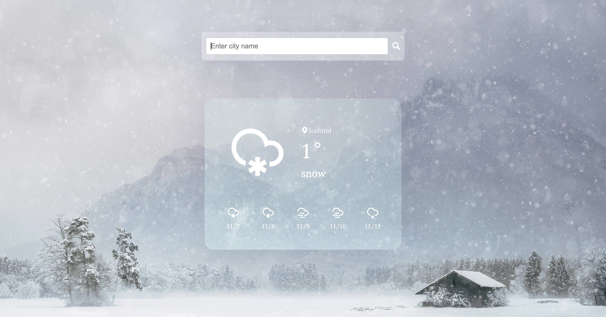

# 02 天气查询应用

[English](README.md) | 简体中文

## 介绍

这是一个天气查询应用，用户可以通过城市名称或邮政编码获取当前天气和未来几天的天气预报。

## 功能

- 查询当前天气
- 显示天气预报
- 根据天气状况动态更换背景

## 使用说明

1. 替换 `script.js` 中的 `appId` 为你的 OpenWeatherMap API Key。
2. 通过输入框输入城市名称或邮政编码，点击搜索按钮或按下 Enter 键进行查询。

## 主要功能

- `searchWeather()`：获取当前天气
- `forecastWeather()`：获取未来天气预报
- `init()`：初始化并显示天气信息

## 注意事项

确保你的 API Key 有效，并注意 API 调用限制。
