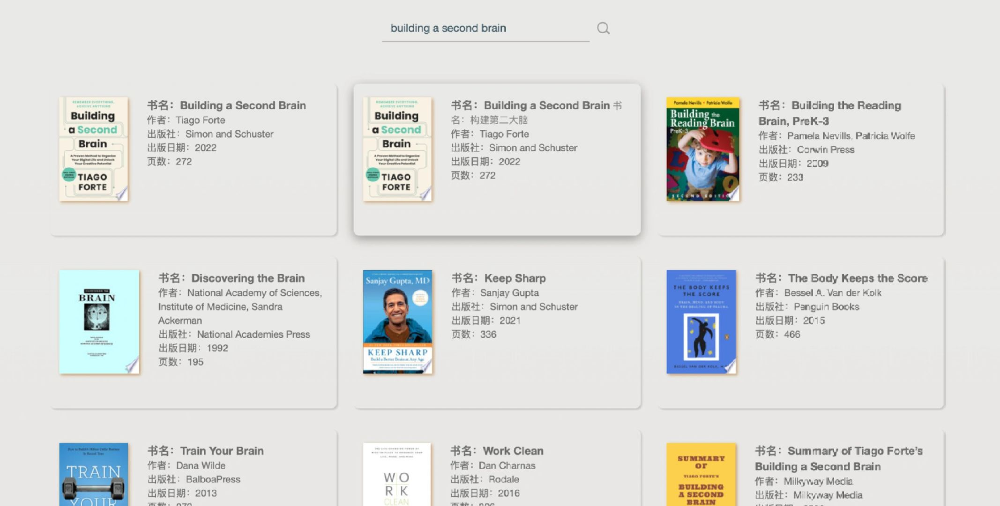

# 03 Book Finder App

**其他语言版本：[English](README.md)**

## 简介

Book Finder App 是一个简单的书籍搜索应用，用户可以输入书名或作者，应用将通过 Google Books API 查询并显示相关的书籍信息。



## 项目结构

```
/BookFinderApp
│
├── src/
│   ├── bootstrap.min.css        # Bootstrap 样式文件
│   ├── style.css                # 自定义样式文件
│   ├── bootstrap.min.js         # Bootstrap JavaScript 文件
│   └── script.js                # 应用的主要 JavaScript 文件
│
└── index.html                   # 应用的主要 HTML 文件
```

## 功能

- **搜索书籍**：用户可以通过输入书名或作者来搜索书籍。
- **展示书籍信息**：搜索结果将以书籍封面、书名、作者、出版社和出版日期的形式展示。
- **加载指示器**：在搜索期间，应用会显示一个加载指示器以提示用户。

## 使用说明

1. **API 密钥**：

   - 为了使用 Google Books API，您需要先申请 API 密钥。访问 [Google Books API](https://developers.google.com/books/docs/v1/using) 页面，按照说明申请。

   - 申请完成后，将获得一个 API 密钥，需要在 `/src/script.js` 中将`api_key`变量的值替换为自己的 API 密钥。

1. **打开 `index.html` 文件**：

   打开 `index.html` 文件可以使用任何现代浏览器，例如 Chrome、Firefox 或 Edge。

1. **进行书籍搜索**：

   - 在搜索框中输入书名或作者。
   - 点击搜索按钮或直接按 Enter 键。
   - 稍等片刻，您将看到搜索结果。

## 注意事项

- 此应用未使用 Node.js，因此无需 Node 环境。
