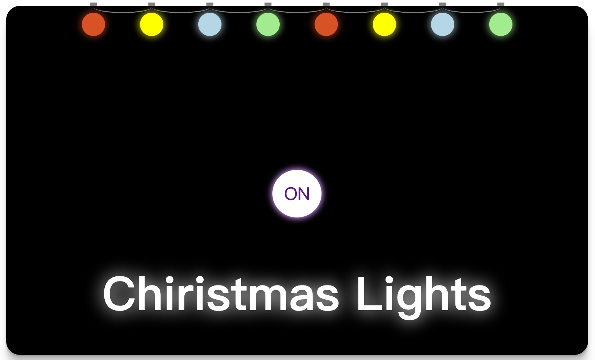

# 项目名称：圣诞灯光效果(Christmas Lights)

**其他语言版本：[English](README.md), [简体中文](README_zh.md)**

## 项目简介

这是一个简单的圣诞灯光效果的 React 应用程序。用户可以通过点击按钮来切换灯光的开关状态，从而控制灯光的动画效果。



## 特性

- 使用 React 和 Bootstrap 创建用户界面
- 通过按钮切换灯光的开和关
- 不同颜色的圆形代表不同的灯光
- 动画效果自适应灯光开关状态

## 技术栈

- React
- Bootstrap
- CSS

## 安装步骤

1. 确保你已经安装了 Node.js 和 npm。
2. 克隆或下载该项目到本地。
3. 进入项目目录并运行以下命令安装依赖：
   ```bash
   npm install
   ```
4. 启动项目：
   ```bash
   npm start
   ```
5. 打开浏览器访问 `http://localhost:3000` 查看应用。

## 使用说明

- 点击按钮可以切换灯光的状态（开/关）。
- 当灯光关闭时，圆形的背景颜色会变为深色。
- 当灯光开启时，灯光将恢复动画效果。

## 代码结构

- `App.js`：主应用文件，包含灯光控制逻辑和组件结构。
- `App.css`：样式文件，可以自定义圆形灯光的样式和布局。
