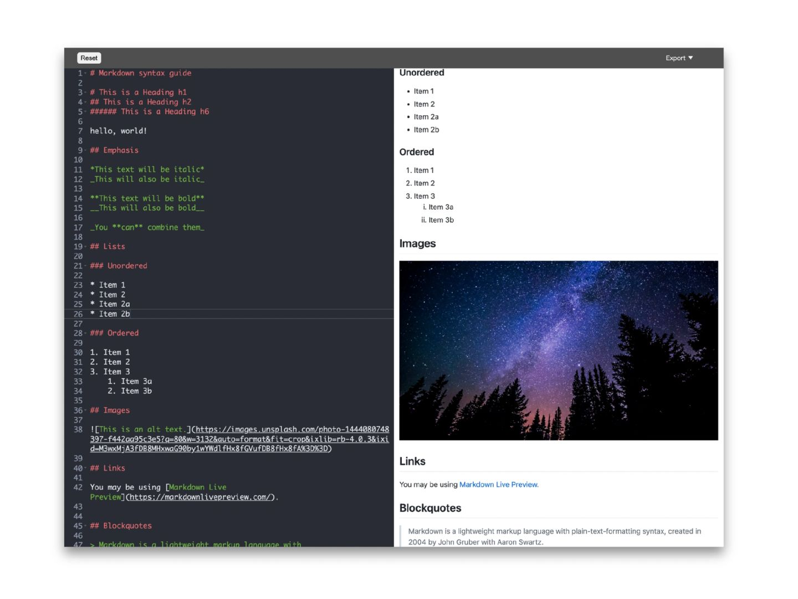

# 07 markdownPreview

**Other language versions: [简体中文](README_zh.md)**

## Introduction

This project is a Markdown editor that allows users to input Markdown syntax and preview it in real-time. It utilizes the Ace editor and Marked.js for parsing and displaying Markdown.



## Directory Structure

```
.
├── dist
│   ├── css
│   │   ├── github-markdown.css
│   │   ├── style.css
│   │   └── style.less
│   ├── font
│   │   └── iconfont.ttf
│   ├── index.html
│   ├── main.js
│   └── main.js.LICENSE.txt
├── package-lock.json
├── package.json
├── src
│   └── index.js
└── webpack.config.js
```

- `dist/`: Directory for compiled files.
  - `css/`: Contains style files.
  - `font/`: Contains font files.
  - `index.html`: Main HTML file.
  - `main.js`: Main JavaScript file.
  - `main.js.LICENSE.txt`: License information for the main JavaScript file.
- `src/`: Directory for source code.
  - `index.js`: The main logic file of the project.
- `package.json`: Configuration for project dependencies and scripts.
- `package-lock.json`: Lock file for specific dependency versions.
- `webpack.config.js`: Webpack configuration file.

## Usage Instructions

1. Install dependencies:

   ```bash
   npm install
   ```

2. Start the development server:

   ```bash
   npm start
   ```

3. Open your browser and visit `http://localhost:3000`.

## Run Scripts

- `npm run build`: Use Webpack to bundle the project.
- `npm start`: Start the development server and open the browser automatically.

## Dependencies

Main dependencies include:

- `ace-builds`: For the code editor.
- `bootstrap`: For styling and responsive layout.
- `dompurify`: For sanitizing user-input HTML content.
- `html2canvas`: For converting HTML to images (unused).
- `jspdf`: For generating PDF files (unused).
- `marked`: For Markdown parsing.
- `puppeteer`: For automating browser actions.

## Features

- Supports various Markdown syntaxes.
- Real-time preview of Markdown content.
- Save Markdown content locally.
- Export Markdown content as PDF file (to be implemented).
