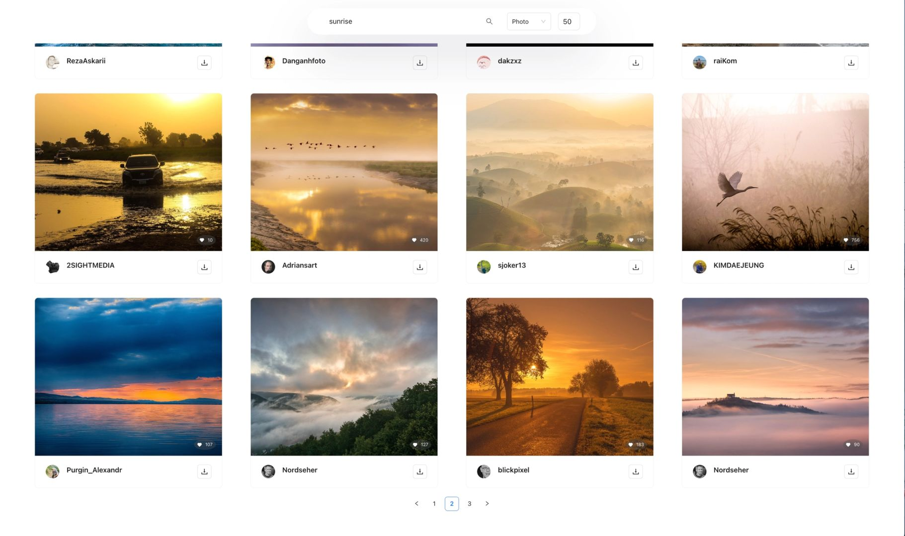

# 09 Image Finder

English | [简体中文](README_zh.md)

## Project Overview

09-imagefinder is an image discovery project aimed at providing a simple and efficient image search and browsing experience through the integration of various front-end libraries and tools. The project combines a modern tech stack, leveraging React as the front-end framework and supporting a user-friendly interface with good user interaction.



## Project Features

- **Image Search**: Users can search for wallpapers using keywords.
- **Image Browsing**: Supports thumbnail mode to display search results, allowing users to quickly browse images and download them.

## Directory Structure

```
.
├── README.md
├── package-lock.json
├── package.json
├── public
│   ├── index.html
│   ├── manifest.json
│   ├── momo.jpg
│   └── robots.txt
└── src
    ├── App.css
    ├── App.js
    ├── components
    │   ├── CustomPagination
    │   ├── ImageContainer
    │   └── SearchContainer
    ├── index.css
    ├── index.js
    ├── reportWebVitals.js
    └── services
        └── api.js
```

## API Key

This project uses the Pixabay API for image searching. You need to register for a Pixabay account first. After registration, visit (https://pixabay.com/api/docs/) and find your API key in the `Search Images/Parameters` section.

Replace the `api` variable value in `src/services/api.js` with your own API key.

## Installation

The project requires a Node.js environment. Please ensure you have Node.js and npm (Node Package Manager) installed.

Run the following command in the project directory to install dependencies:

```bash
npm install
```

## Running the Project

After installation, you can start the development server with the following command:

```bash
npm start
```

Once started, open your browser and navigate to `http://localhost:3000` to see the main interface of the project.

## Build

To build the project, use the command `npm run build`. This command will compile the project code and package it into deployable static files.

```bash
npm run build
```

Once the build is complete, the deployment files will be generated in the `build` directory.

```

```
