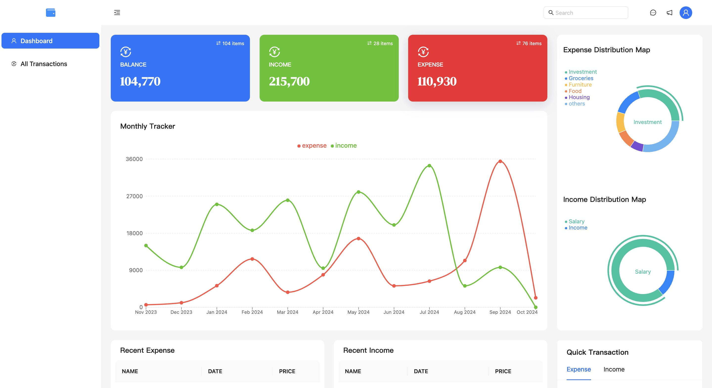

# 10 Expense Tracking

English | [简体中文](README_zh.md)

## Project Overview

This is an expense tracking application that allows users to record and manage their income and expenses. Users can view transaction details, generate reports, and visualize data.



## Directory Structure

```
.
├── README.md
├── package-lock.json
├── package.json
├── public
│   ├── Fonts
│   │   └── DMSerifDisplay-Regular.ttf
│   ├── favicon.ico
│   └── index.html
└── src
    ├── App.css
    ├── App.js
    ├── components
    │   ├── Footer.js
    │   ├── Header.js
    │   ├── Sidebar.js
    │   └── index.js
    ├── context
    │   └── index.js
    ├── data
    │   └── index.js
    ├── index.js
    ├── pages
    │   ├── TransactionDetails.js
    │   ├── dashboard
    │   └── index.js
    ├── reportWebVitals.js
    ├── router
    │   └── index.js
    └── utils
        └── theme.js
```

## Features

- **Add Income and Expenses**: Users can input income or expense information through a simple form.
- **View Transaction Details**: Provides detailed transaction record viewing functionality.
- **Data Visualization**: Uses charts to display transaction distribution and monthly tracking, helping users analyze their financial situation.
- **Tag Management**: Categorizes transactions using tags for easier organization and search.

## Technology Stack

- **Frontend**: Built using the React framework for the user interface.
- **Styling**: Utilizes the Ant Design component library to provide an elegant user interface and responsive design.
- **State Management**: Employs React's Context API and Hooks for state management.
- **Data Visualization**: Uses Recharts for data chart presentation.

## Installation and Running

1. Install dependencies:

   ```bash
   npm install
   ```

2. Run the application:

   ```bash
   npm start
   ```

   Open your browser and visit `http://localhost:3000` to view the application.
