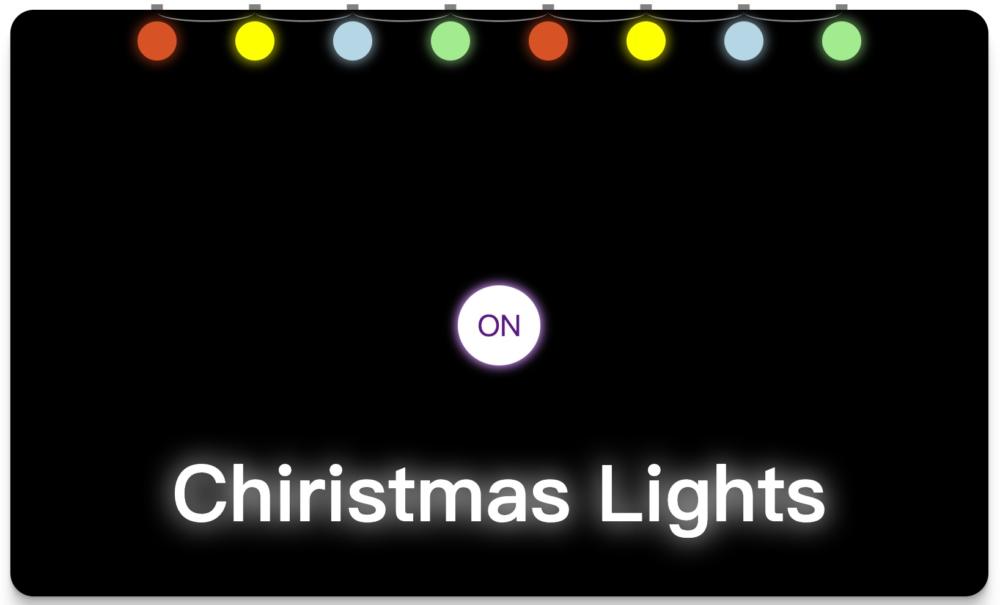
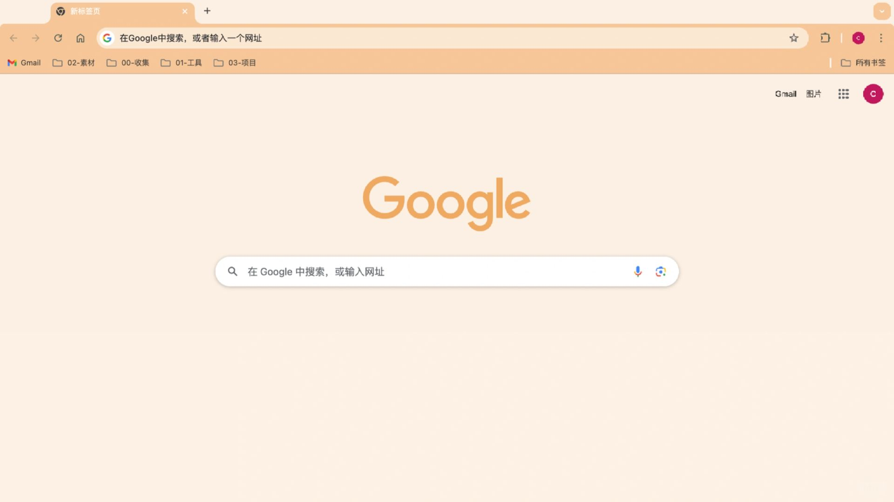
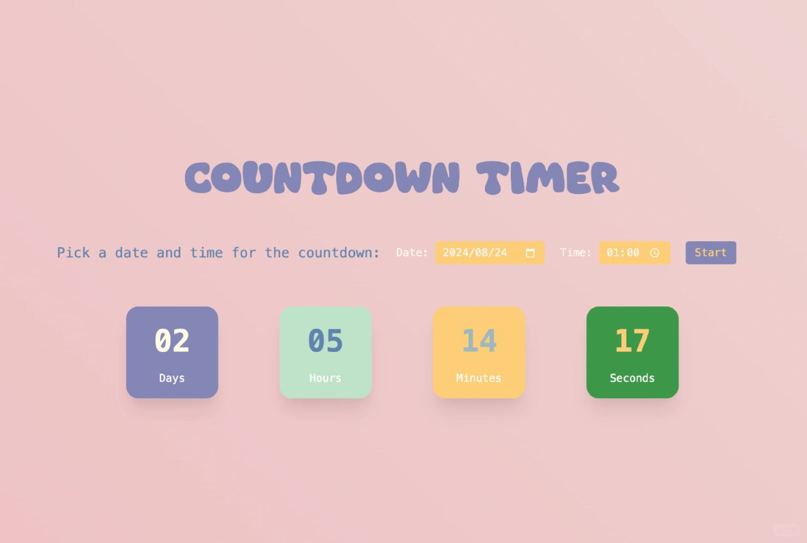
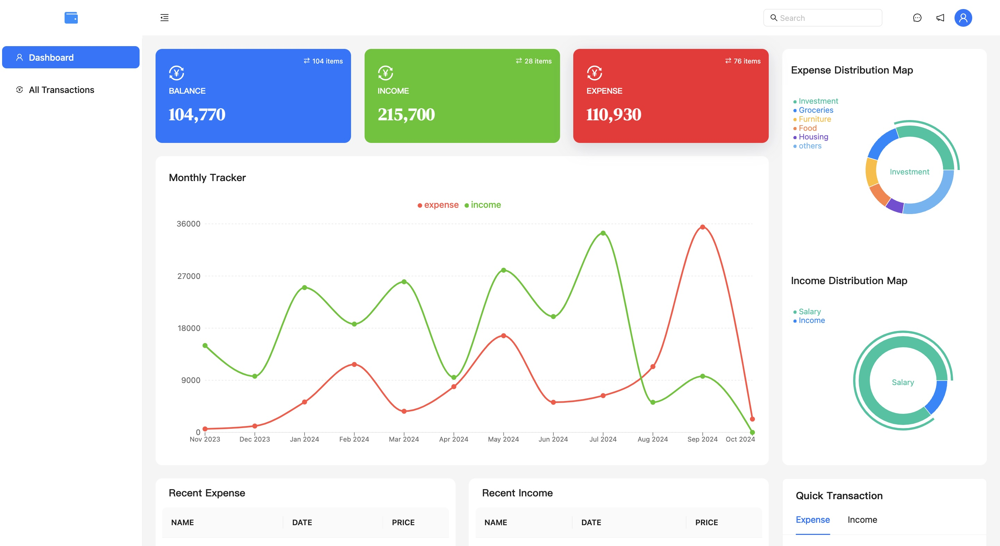

# Front-End Beginner Projects

English | [简体中文](./README_zh.md)

- [01 Todo List](./01-todolist/README.md)
- [02 Weather Query Application](./02-weatherapp/README.md)
- [03 Book Finder App](./03-bookfinder/README.md)
- [04 Christmas Lights Effect](./04-christmaslight/README.md)
- [05 Chrome Theme Plugin](./05-chromethemeextension/README.md)
- [06 Countdown](./06-countdownapp/README.md)
- [07 Markdown Preview](./07-markdownpreview/README.md)
- [08 Pomodoro App](./08-pomodoro/README.md)
- [09 Image Finder](./09-imagefinder/README.md)
- [10 Expense Tracker App](./10-expensetrackerapp/README.md)

## 01 Todo List

This is a simple Todo List application that allows users to add, delete, and modify the status of tasks. The project is built using native JavaScript and HTML/CSS, with data persisted through `localStorage`, aiming to provide a user-friendly task management tool.

Project Source: [app-ideas/To-Do-App](https://github.com/florinpop17/app-ideas/blob/master/Projects/2-Intermediate/To-Do-App.md)

---

## 02 Weather Query Application

This is a weather query application that allows users to get the current weather and weather forecasts for the next few days by entering a city name or postal code.

Project Source: [app-ideas/Weather-App](https://github.com/florinpop17/app-ideas/blob/master/Projects/1-Beginner/Weather-App.md)

Reference YouTube Tutorial: [Code A Weather App in Pure JavaScript](https://youtu.be/ZPG2wGNj6J4?si=zz_2-qsFUZkJp1ab)

---

## 03 Book Finder App

The Book Finder App is a simple book search application where users can enter a book title or author, and the app will query and display relevant book information through the Google Books API.

---

## 04 Christmas Lights Effect

This is a simple React application that simulates a Christmas lights effect. Users can control the on/off state of the lights and adjust the animation effects by clicking buttons.

Project Source: [app-ideas/Christmas-Lights-App](https://github.com/florinpop17/app-ideas/blob/master/Projects/1-Beginner/Christmas-Lights-App.md)

---

## 05 Chrome Theme Plugin

This project includes multiple custom theme plugins designed to provide diverse visual experiences for the Chrome browser, catering to the personalized needs of different users.

---

## 06 Countdown

This is a simple countdown application that allows users to set a deadline and time, with real-time updates to the countdown display. The code is implemented using native JavaScript and utilizes the browser's `localStorage` feature to save user settings.

---

## 07 Markdown Preview

This project is a Markdown editor that allows users to input Markdown syntax and preview it in real-time. It uses the Ace editor and Marked.js for parsing and display.

Project Source: [app-ideas/Markdown-Previewer](https://github.com/florinpop17/app-ideas/blob/master/Projects/2-Intermediate/Markdown-Previewer.md)

---

## 08 Pomodoro App

This is a React-based Pomodoro application that allows users to manage work and rest times using the Pomodoro technique, and provides multiple white noise options to enhance the work atmosphere.

Project Source: [app-ideas/Pomodoro-Clock](https://github.com/florinpop17/app-ideas/blob/master/Projects/1-Beginner/Pomodoro-Clock.md)

---

## 09 Image Finder

09-imagefinder is an image search tool designed to provide a simple and efficient image search and browsing experience by integrating various front-end libraries and tools.

---

## 10 Expense Tracker App

This is an expense tracking application that allows users to record and manage income and expenses. Users can view transaction details, generate reports, and visualize data.

Reference Project: [zuiidea/antd-admin](https://github.com/zuiidea/antd-admin)

## License

This project is licensed under the [MIT license](./LICENSE).
