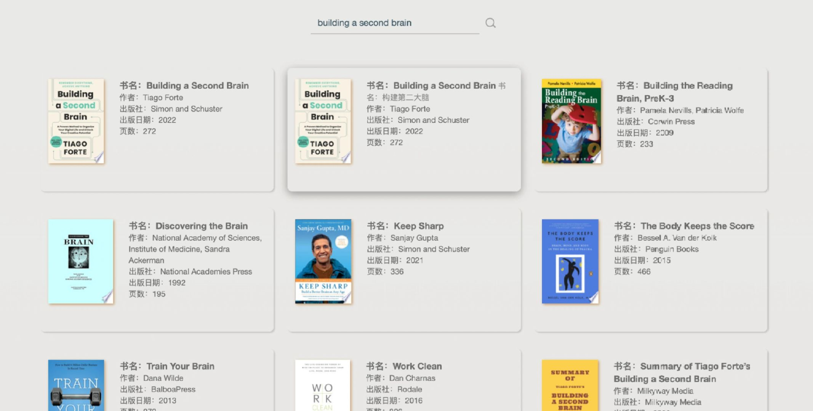
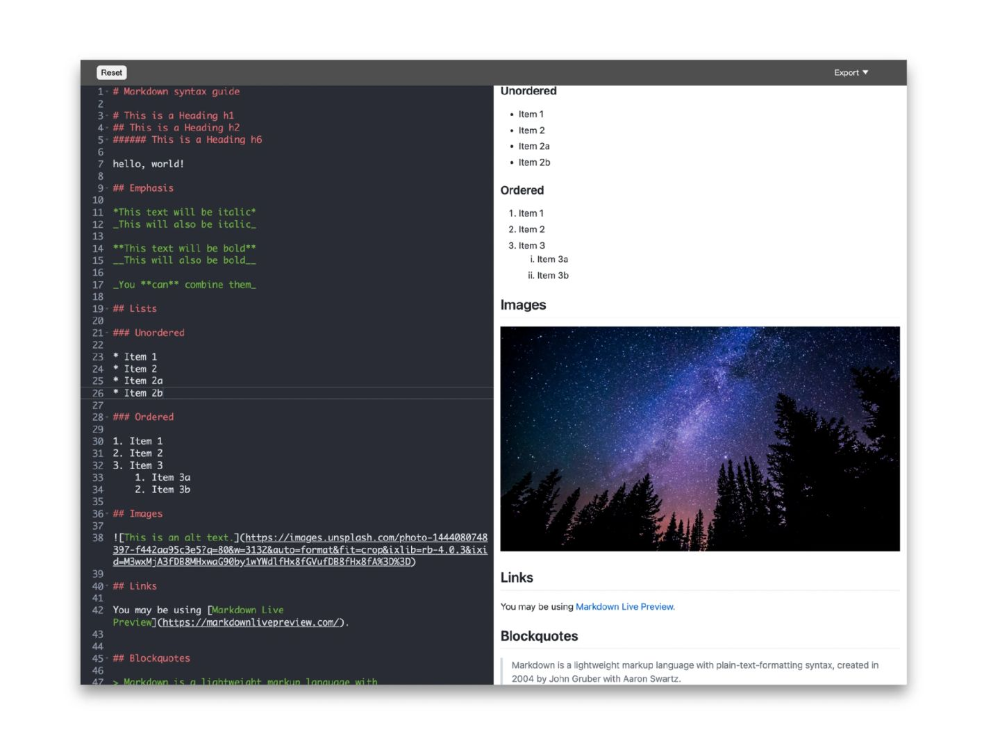

# 前端入门练习项目集锦

[English](./README.md) | 简体中文

- [01 Todo List](./01-todolist/README.md)
- [02 Weather Query Application](./02-weatherapp/README.md)
- [03 Book Finder App](./03-bookfinder/README.md)
- [04 Christmas Lights Effect](./04-christmaslight/README.md)
- [05 Chrome Theme Plugin](./05-chromethemeextension/README.md)
- [06 Countdown](./06-countdownapp/README.md)
- [07 Markdown Preview](./07-markdownpreview/README.md)
- [08 Pomodoro App](./08-pomodoro/README.md)
- [09 Image Finder](./09-imagefinder/README.md)
- [10 Expense Tracker App](./10-expensetrackerapp/README.md)

## 01 Todo List

这是一个简单的 Todo List 应用，允许用户添加、删除和修改任务的状态。该项目使用原生 JavaScript 和 HTML/CSS 构建，数据通过 `localStorage` 持久化，旨在提供一个用户友好的任务管理工具。

项目来源：[app-ideas/To-Do-App](https://github.com/florinpop17/app-ideas/blob/master/Projects/2-Intermediate/To-Do-App.md)

---

## 02 Weather Query Application

这是一个天气查询应用，允许用户通过输入城市名称或邮政编码来获取当前天气和未来几天的天气预报。

项目来源：[app-ideas/Weather-App](https://github.com/florinpop17/app-ideas/blob/master/Projects/1-Beginner/Weather-App.md)

参考油管视频教程：[Code A Weather App in Pure JavaScript](https://youtu.be/ZPG2wGNj6J4?si=zz_2-qsFUZkJp1ab)

---

## 03 Book Finder App

Book Finder App 是一个简单的书籍搜索应用，用户可以输入书名或作者，应用将通过 Google Books API 查询并显示相关的书籍信息。

---

## 04 Christmas Lights Effect

这是一个简单的 React 应用，模拟圣诞灯光效果。用户可以通过点击按钮来控制灯光的开关状态，并调整动画效果。

项目来源：[app-ideas/Christmas-Lights-App](https://github.com/florinpop17/app-ideas/blob/master/Projects/1-Beginner/Christmas-Lights-App.md)

---

## 05 Chrome Theme Plugin

这个项目包含多个定制主题插件，旨在为 Chrome 浏览器提供多样的视觉体验，满足不同用户的个性化需求。

---

## 06 Countdown

这是一个简单的倒计时应用，允许用户设置截止日期和时间，并实时更新倒计时显示。代码使用原生 JavaScript 实现，并利用浏览器的 `localStorage` 功能保存用户设置。

---

## 07 Markdown Preview

该项目是一个 Markdown 编辑器，允许用户输入 Markdown 语法并实时预览。它使用 Ace 编辑器和 Marked.js 进行解析和显示。

项目来源：[app-ideas/Markdown-Previewer](https://github.com/florinpop17/app-ideas/blob/master/Projects/2-Intermediate/Markdown-Previewer.md)

---

## 08 Pomodoro App

这是一个基于 React 的番茄钟应用，允许用户使用番茄工作法管理工作和休息时间，并提供多种白噪音选项以增强工作氛围。

项目来源：[app-ideas/Pomodoro-Clock](https://github.com/florinpop17/app-ideas/blob/master/Projects/1-Beginner/Pomodoro-Clock.md)

---

## 09 Image Finder

09-imagefinder 是一个图像搜索工具，旨在通过集成各种前端库和工具提供简单高效的图像搜索和浏览体验。

---

## 10 Expense Tracker App

这是一个开支跟踪应用，允许用户记录和管理收入和支出。用户可以查看交易详情、生成报告并可视化数据。

参考项目：[zuiidea/antd-admin](https://github.com/zuiidea/antd-admin)

## 许可证

本项目采用 [MIT 许可证](./LICENSE) 授权。
